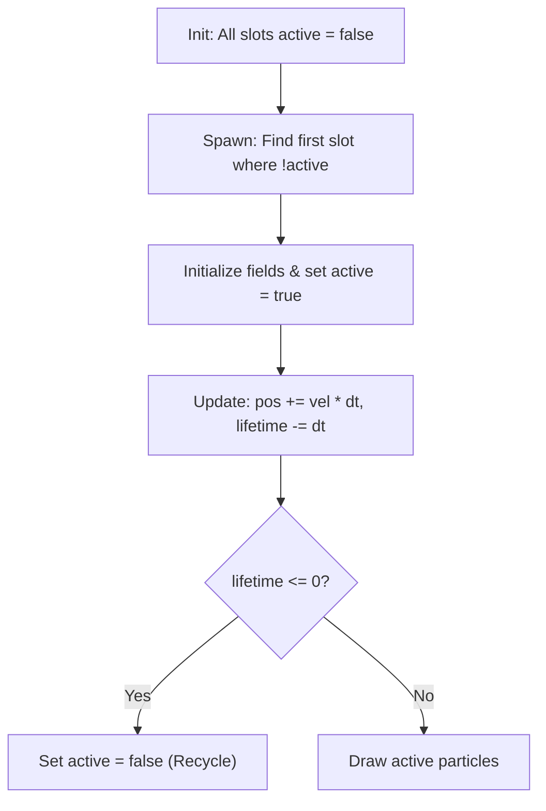

# C Game Pools & Particle Systems Skill

This skill explains how to build high-performance, zero-allocation object pools and particle effects in C99, drawing from the fixed-array management demonstrated in Dr. Turtle (`03_drturtle_enemies.c`).

---

## 1. The Fixed-Pool Philosophy

In C game development, allocating and freeing memory on the heap every frame causes cache misses, memory fragmentation, and frame drops. 

Following Dr. Turtle's pattern, all dynamic entities (particles, projectile badges, log entries) are pre-allocated in static, fixed-capacity arrays with boolean active flags:

```c
// Compile-time fixed capacity
#define MAX_PARTICLES 128

typedef struct {
    Vector2 position;
    Vector2 velocity;
    Color color;
    float size;
    float lifetime;
    float max_lifetime;
    bool active;
} Particle;

typedef struct {
    Particle pool[MAX_PARTICLES];
} ParticleSystem;
```

---

## 2. Pool Lifecycle Operations



### 2.1 Spawning with Slot Recycling
```c
void SpawnParticle(ParticleSystem *ps, Vector2 pos, Vector2 vel, Color color, float size, float lifetime) {
    for (int i = 0; i < MAX_PARTICLES; i++) {
        if (!ps->pool[i].active) {
            ps->pool[i].position = pos;
            ps->pool[i].velocity = vel;
            ps->pool[i].color = color;
            ps->pool[i].size = size;
            ps->pool[i].lifetime = lifetime;
            ps->pool[i].max_lifetime = lifetime;
            ps->pool[i].active = true;
            return; // Slot found and claimed
        }
    }
    // Pool is full: silently drop or overwrite oldest
}
```

### 2.2 Updating Active Elements
```c
void UpdateParticleSystem(ParticleSystem *ps, float dt) {
    for (int i = 0; i < MAX_PARTICLES; i++) {
        if (ps->pool[i].active) {
            Particle *p = &ps->pool[i];

            p->position.x += p->velocity.x * dt;
            p->position.y += p->velocity.y * dt;
            p->lifetime -= dt;

            if (p->lifetime <= 0.0f) {
                p->active = false; // Immediately available for reuse
            }
        }
    }
}
```

### 2.3 Drawing with Fading
```c
void DrawParticleSystem(const ParticleSystem *ps) {
    for (int i = 0; i < MAX_PARTICLES; i++) {
        if (ps->pool[i].active) {
            const Particle *p = &ps->pool[i];
            float alpha = p->lifetime / p->max_lifetime;
            Color faded = ColorAlpha(p->color, alpha);
            
            // Fading circle
            DrawCircleV(p->position, p->size * alpha, faded);
        }
    }
}
```

---

## 3. Invoker Elemental Particle Recipes

### 3.1 Quas (Ice Crystals)
- **Visual**: Slow, gentle drifting flakes with slight downward gravity.
- **Color**: Ice Blue `(Color){ 0, 210, 255, 255 }`
- **Velocity**: `vx = GetRandomValue(-20, 20)`, `vy = GetRandomValue(10, 40)`
- **Duration**: `0.8f` to `1.2f` seconds.

### 3.2 Wex (Storm Spark)
- **Visual**: Fast, erratic horizontal and diagonal bursts.
- **Color**: Electric Pink/Violet `(Color){ 224, 64, 251, 255 }`
- **Velocity**: High speed `vx = GetRandomValue(-150, 150)`, `vy = GetRandomValue(-150, 150)`
- **Duration**: `0.2f` to `0.4f` seconds (snappy flash).

### 3.3 Exort (Fire Embers)
- **Visual**: Buoyant rising sparks accelerating upward.
- **Color**: Amber/Orange `(Color){ 255, 87, 34, 255 }`
- **Velocity**: Upward bias `vx = GetRandomValue(-30, 30)`, `vy = GetRandomValue(-80, -30)`
- **Duration**: `0.5f` to `0.9f` seconds.

### 3.4 Invoke Radial Burst
- When `R` is pressed, burst 16 particles in a radial 360-degree circle:
```c
void BurstInvokeEffect(ParticleSystem *ps, Vector2 center, Color spellColor) {
    int count = 16;
    float speed = 120.0f;
    for (int i = 0; i < count; i++) {
        float angle = (float)i * (2.0f * PI / (float)count);
        Vector2 vel = {
            .x = cosf(angle) * speed,
            .y = sinf(angle) * speed
        };
        SpawnParticle(ps, center, vel, spellColor, 4.0f, 0.4f);
    }
}
```

---

## 4. Circular Ring Buffer Pattern (Zero Allocation Event Feed)

For continuous feeds where order matters (like the Action Log):

```c
#define FEED_CAPACITY 8

typedef struct {
    ActionLogEntry entries[FEED_CAPACITY];
    int head; // Points to newest entry index
    int count;
} CircularFeed;

void PushFeed(CircularFeed *feed, ActionLogEntry entry) {
    feed->head = (feed->head + 1) % FEED_CAPACITY;
    feed->entries[feed->head] = entry;
    if (feed->count < FEED_CAPACITY) feed->count++;
}
```
This guarantees $O(1)$ push time with zero memory shuffling and zero allocations.
