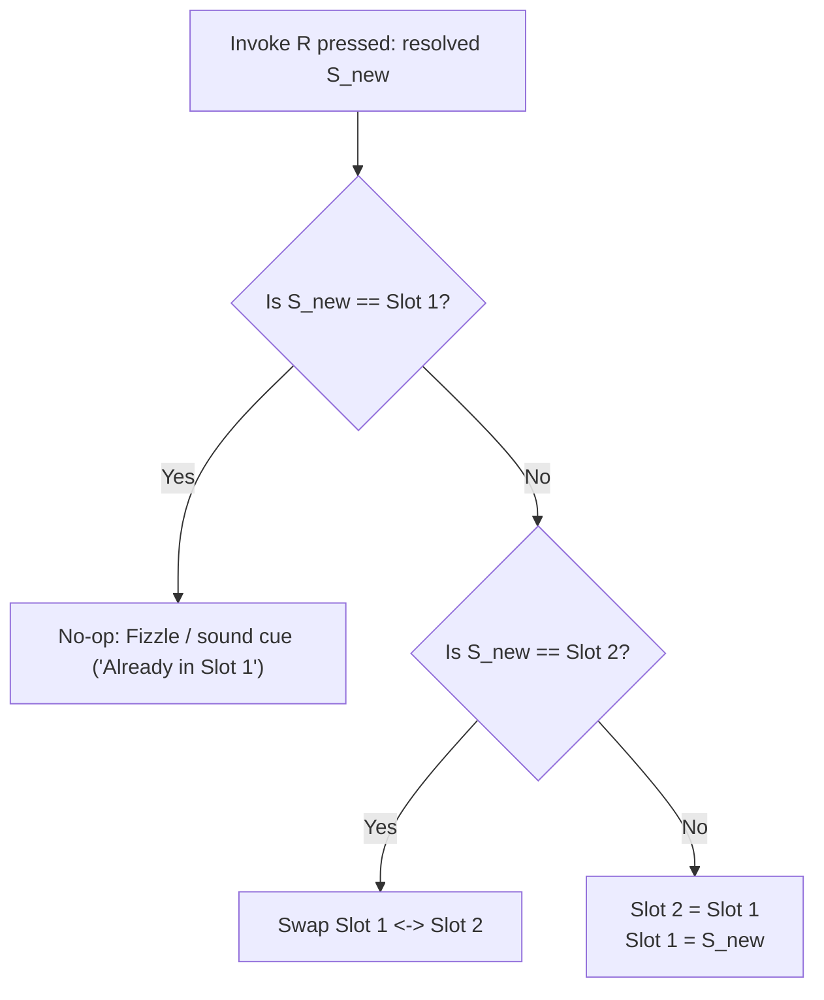

# Dota 2 Invoker Mechanics Skill

This skill documents the exact game rules, algorithms, and mathematical models behind the Dota 2 Invoker spell casting mechanics.

---

## 1. Elemental Orbs & Theme Colors

| Orb | Key | Element | Hex Color | Raylib Color (`Color`) |
| :--- | :---: | :--- | :---: | :--- |
| **Quas** | `Q` | Ice / Cold | `#00D2FF` | `(Color){ 0, 210, 255, 255 }` (Cyan) |
| **Wex** | `W` | Storm / Swiftness | `#E040FB` | `(Color){ 224, 64, 251, 255 }` (Violet/Pink) |
| **Exort**| `E` | Fire / Destruction | `#FF5722` | `(Color){ 255, 87, 34, 255 }` (Amber/Orange) |

---

## 2. FIFO Orb Buffer Mechanics

The player maintains a buffer of exactly 3 active orbs. It operates as a **First-In, First-Out (FIFO) sliding window**:

```text
[Orb 0] (Oldest)  <-  [Orb 1]  <-  [Orb 2] (Newest)
```

### 2.1 Shift Algorithm
When a key (`Q`, `W`, or `E`) is pressed:
1. `buffer[0] = buffer[1]` (oldest is discarded)
2. `buffer[1] = buffer[2]`
3. `buffer[2] = new_orb`

### 2.2 Buffer Incomplete State
If fewer than 3 orbs have been pressed since start (e.g., initial state has `ORB_NONE`), an invocation attempt must report: *"Cannot invoke: Need 3 orbs"*.

---

## 3. The 10 Spells & Multiset Combinations

Order inside the buffer **does not matter**; only the multiset count $(Q, W, E)$ determines the spell:
$$\binom{3 + 3 - 1}{3} = \frac{5!}{3!2!} = 10 \text{ unique combinations}$$

### 3.1 Master Spell Table

| Spell Name | Recipe | Quas | Wex | Exort | Legacy Key | Theme Color |
| :--- | :---: | :---: | :---: | :---: | :---: | :--- |
| **Cold Snap** | `Q Q Q` | 3 | 0 | 0 | `Y` | Cyan (`#00D2FF`) |
| **Ghost Walk** | `Q Q W` | 2 | 1 | 0 | `V` | Ice Violet (`#80B0FF`) |
| **Ice Wall** | `Q Q E` | 2 | 0 | 1 | `G` | Frost Ember (`#80E0D0`) |
| **EMP** | `W W W` | 0 | 3 | 0 | `C` | Bright Violet (`#E040FB`) |
| **Tornado** | `W W Q` | 1 | 2 | 0 | `X` | Sky Lilac (`#B388FF`) |
| **Alacrity** | `W W E` | 0 | 2 | 1 | `Z` | Magenta Fire (`#FF4081`) |
| **Sun Strike** | `E E E` | 0 | 0 | 3 | `T` | Pure Amber (`#FF5722`) |
| **Forge Spirit** | `E E Q` | 1 | 0 | 2 | `F` | Volcanic Gold (`#FF9100`) |
| **Chaos Meteor** | `E E W` | 0 | 1 | 2 | `D` | Molten Crimson (`#FF1744`) |
| **Deafening Blast**| `Q W E` | 1 | 1 | 1 | `B` | Prismatic White / Silver (`#EDE7F6`) |

### 3.2 Resolution Algorithm
To resolve a spell from an `OrbBuffer`:
1. Count elements:
   ```c
   int q = 0, w = 0, e = 0;
   for (int i = 0; i < 3; i++) {
       if (buffer->orbs[i] == ORB_QUAS) q++;
       else if (buffer->orbs[i] == ORB_WEX) w++;
       else if (buffer->orbs[i] == ORB_EXORT) e++;
   }
   if (q + w + e < 3) return SPELL_NONE;
   ```
2. Match $(q, w, e)$ against the spell table (via lookup array or `if`/`switch` branching).

---

## 4. Active Spell Slot Shifting (Keys `D` & `F`)

Invoker has two active slots: **Slot 1 (`D`)** (Primary / Most Recent) and **Slot 2 (`F`)** (Secondary / Older).

When **`R` (Invoke)** is pressed and resolves to spell $S_{new}$:



### Pseudo-logic
```c
if (new_spell == slot1) {
    // Already active in primary slot: no change
    return INVOKE_DUPLICATE_PRIMARY;
} else if (new_spell == slot2) {
    // Promote secondary to primary, demote primary to secondary
    SpellId temp = slot1;
    slot1 = slot2;
    slot2 = temp;
    return INVOKE_SWAPPED;
} else {
    // Shift: slot1 pushed to slot2, new_spell into slot1
    slot2 = slot1;
    slot1 = new_spell;
    return INVOKE_NEW;
}
```

---

## 5. Mode Calculations & Formulas

### 5.1 Arcane Surge (Overload Gauge)
- **Gauge Range**: $0.0 \le \text{surge} \le 10.0$
- **Continuous Decay**:
  $$\text{surge}_{t} = \max(0.0, \text{surge}_{t - \Delta t} - (\text{decay\_rate} \times \Delta t))$$
  *(Default base decay rate: $0.4\text{ units/sec}$)*
- **Invoke Boost**: $+1.0\text{ unit}$ per invocation.
- **Anti-Spam Multiplier**:
  If $\text{spell}_{new} == \text{spell}_{last}$, charge is $0.0$ or halved ($+0.5$), requiring the player to alternate spells to sustain momentum.
- **Victory Condition**: $\text{surge} \ge 10.0$ triggers **Surge Overload**.

### 5.2 Actions Per Minute (APM) & Reaction Time
- **APM**:
  $$\text{APM} = \frac{\text{Valid Actions}}{\text{Elapsed Time in Seconds}} \times 60$$
- **Average Reaction Time**:
  $$\text{Avg Reaction (ms)} = \frac{\sum_{i=1}^{N} \text{Time to Invoke}_{i}}{N}$$
- **Score Multiplier**:
  $$\text{Score} = \text{Base Points} \times (1 + 0.1 \times \text{Streak})$$
