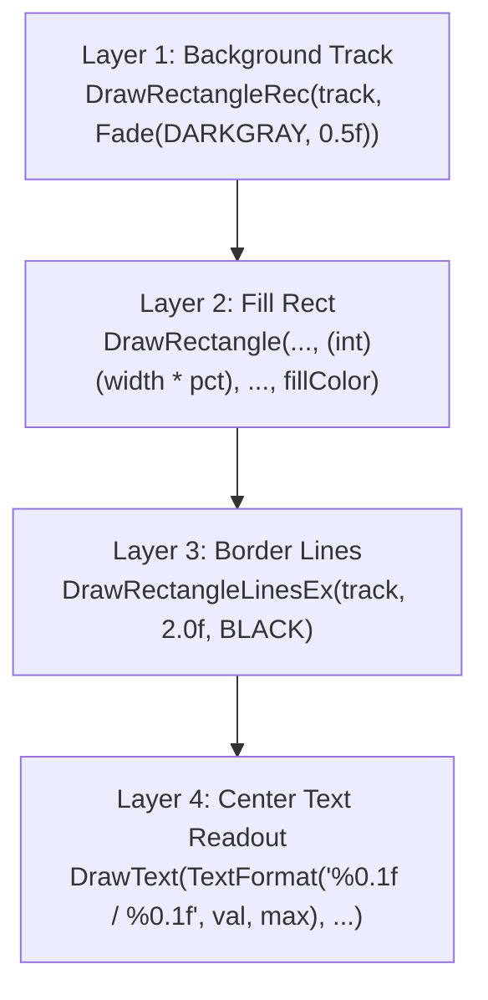

# Raylib HUD & Meter Systems Skill

This skill provides immediate-mode rendering patterns and state handling for game HUDs, dynamic decay meters, cooldown overlays, and alpha-fading action logs in Raylib C99, modeled on patterns from Dr. Turtle and arcade action games.

---

## 1. The Immediate-Mode Meter Pattern

In Raylib, a progress bar or gauge is rendered using a three-layer immediate-mode stack:



### 1.1 Generic Meter Function
```c
void DrawMeter(Rectangle bounds, float current, float max, Color fillColor, Color trackColor) {
    if (max <= 0.0f) max = 1.0f;
    float pct = current / max;
    if (pct < 0.0f) pct = 0.0f;
    if (pct > 1.0f) pct = 1.0f;

    // 1. Background Track
    DrawRectangleRec(bounds, trackColor);

    // 2. Animated Fill
    Rectangle fillBounds = {
        .x = bounds.x,
        .y = bounds.y,
        .width = bounds.width * pct,
        .height = bounds.height
    };
    DrawRectangleRec(fillBounds, fillColor);

    // 3. Border Outline
    DrawRectangleLinesEx(bounds, 2.0f, (Color){ 20, 20, 30, 255 });
}
```

---

## 2. The Arcane Surge Overload Bar (Phase 6.2)

The Arcane Surge bar represents momentum. It continuously decays and shifts color dynamically as capacity increases.

### 2.1 Dynamic Color Lerping
As the gauge fills from `0.0f` to `10.0f`, shift the color through three elemental thresholds:
- **Low (0% – 40%)**: Cyan (`#00D2FF`)
- **Mid (40% – 80%)**: Arcane Violet (`#E040FB`)
- **High / Near Overload (80% – 100%)**: Blazing Gold (`#FFD700`)

```c
Color GetSurgeColor(float pct) {
    if (pct < 0.4f) {
        return (Color){ 0, 210, 255, 255 }; // Cyan
    } else if (pct < 0.8f) {
        return (Color){ 224, 64, 251, 255 }; // Violet
    } else {
        return (Color){ 255, 215, 0, 255 }; // Gold
    }
}
```

### 2.2 Overload Pulse Effect
When `surge_meter >= surge_max`, generate an electric pulse using Raylib's `GetTime()`:
```c
bool is_overloaded = (ctx->surge_meter >= ctx->surge_max);
if (is_overloaded) {
    // Pulse alpha between 0.6 and 1.0 using sine wave
    float pulse = 0.8f + 0.2f * sinf((float)GetTime() * 8.0f);
    DrawRectangleLinesEx(surge_bounds, 4.0f, ColorAlpha(GOLD, pulse));
    DrawText("SURGE OVERLOAD!", text_x, text_y, 20, ColorAlpha(WHITE, pulse));
}
```

---

## 3. Spell Slot Cooldown Sweeps (Keys `D` & `F`)

For active spell slots on cooldown, render a dark translucent sweep overlay that shrinks as the cooldown timer reaches zero:

```c
void DrawSpellCooldown(Rectangle slot_rect, float cd_remaining, float cd_max) {
    if (cd_remaining <= 0.0f || cd_max <= 0.0f) return;

    float pct = cd_remaining / cd_max; // 1.0 (just cast) down to 0.0 (ready)

    // Cooldown overlay box (vertical drain)
    Rectangle cd_box = {
        .x = slot_rect.x,
        .y = slot_rect.y + slot_rect.height * (1.0f - pct),
        .width = slot_rect.width,
        .height = slot_rect.height * pct
    };
    DrawRectangleRec(cd_box, ColorAlpha(BLACK, 0.65f));

    // Centered countdown timer text (e.g. "1.4s")
    const char *cd_text = TextFormat("%.1fs", cd_remaining);
    int font_size = 18;
    int tw = MeasureText(cd_text, font_size);
    DrawText(cd_text, 
             (int)(slot_rect.x + (slot_rect.width - tw) / 2),
             (int)(slot_rect.y + (slot_rect.height - font_size) / 2),
             font_size, RAYWHITE);
}
```

---

## 4. Action Log / Event Feed with Alpha Fade (Phase 3)

The action log maintains a fixed buffer of recent events. Each entry smoothly fades out over its `lifetime`.

```c
#define MAX_LOG_ENTRIES 6
#define LOG_MAX_LEN 64

typedef struct {
    char text[LOG_MAX_LEN];
    Color color;
    float lifetime;
    float max_lifetime;
} ActionLogEntry;

typedef struct {
    ActionLogEntry entries[MAX_LOG_ENTRIES];
    int count;
} ActionLog;
```

### 4.1 Update & Decay
```c
void UpdateActionLog(ActionLog *log, float dt) {
    for (int i = 0; i < log->count; i++) {
        log->entries[i].lifetime -= dt;
    }

    // Remove expired entries by shifting
    for (int i = 0; i < log->count; ) {
        if (log->entries[i].lifetime <= 0.0f) {
            // Shift subsequent entries down
            for (int j = i; j < log->count - 1; j++) {
                log->entries[j] = log->entries[j + 1];
            }
            log->count--;
        } else {
            i++;
        }
    }
}
```

### 4.2 Drawing with Fading Alpha
```c
void DrawActionLog(const ActionLog *log, int startX, int startY, int lineHeight) {
    for (int i = 0; i < log->count; i++) {
        const ActionLogEntry *entry = &log->entries[i];
        
        // Calculate smooth alpha from 1.0 -> 0.0
        float alpha = entry->lifetime / entry->max_lifetime;
        if (alpha < 0.0f) alpha = 0.0f;
        if (alpha > 1.0f) alpha = 1.0f;

        Color fadedColor = ColorAlpha(entry->color, alpha);
        DrawText(entry->text, startX, startY + (i * lineHeight), 18, fadedColor);
    }
}
```

---

## 5. UI Timing & Blinking Text Idioms

From Dr. Turtle (`04_drturtle_gui.c`):

1. **Blinking Prompts** (e.g. *"PRESS ENTER TO START"*):
   ```c
   // Blinks every half-second (30 frames at 60 FPS)
   if ((framesCounter / 30) % 2 == 0) {
       DrawText("PRESS ENTER TO INVOKE", center_x, center_y, 22, GOLD);
   }
   ```
2. **Zero-Allocation Formatting**:
   - Never call `sprintf()` into dynamic memory.
   - Use Raylib's built-in `TextFormat()`:
     ```c
     DrawText(TextFormat("SCORE: %05d", ctx->score), 20, 20, 24, ORANGE);
     DrawText(TextFormat("STREAK: %d (x%.1f)", ctx->streak, 1.0f + 0.1f * ctx->streak), 20, 50, 20, YELLOW);
     ```
