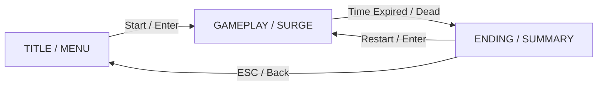
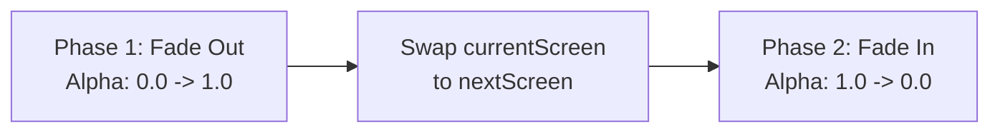

# Raylib Screen Management & State Machines

This skill provides screen and game-state management architectures in C99 using Raylib, drawing directly from official Raylib project conventions (notably Ramon Santamaria's `00_drturtle_screens.c` and the Raylib Game Template).

---

## 1. Core Architecture: The Enum-Driven State Machine

Raylib projects avoid heavy object-oriented state graphs, virtual tables, or complex callback webs. Instead, screen flow is driven by a simple C `enum` and dual `switch` blocks within the frame loop.



### 1.1 Screen Enumeration
Define an enum representing all discrete game viewports:

```c
typedef enum {
    SCREEN_TITLE = 0,
    SCREEN_PRACTICE,
    SCREEN_TIME_ATTACK,
    SCREEN_SURGE,
    SCREEN_GAME_OVER
} GameScreen;
```

### 1.2 The Dual-Switch Frame Loop
In the main game loop, execution is split into two phases: **Update** (state mutation, input, transitions) and **Draw** (rendering).

```c
// Track active viewport
GameScreen currentScreen = SCREEN_TITLE;

while (!WindowShouldClose()) {
    float dt = GetFrameTime();

    // -------------------------------------------------------------
    // PHASE 1: UPDATE & SCREEN TRANSITIONS
    // -------------------------------------------------------------
    switch (currentScreen) {
        case SCREEN_TITLE:
            UpdateTitleScreen(&gameContext, dt);
            if (IsKeyPressed(KEY_ENTER)) {
                ResetGameplayState(&gameContext);
                currentScreen = SCREEN_TIME_ATTACK;
            }
            break;

        case SCREEN_TIME_ATTACK:
            UpdateSpeedTrainer(&gameContext, dt);
            if (gameContext.timer_remaining <= 0.0f) {
                currentScreen = SCREEN_GAME_OVER;
            }
            break;

        case SCREEN_GAME_OVER:
            UpdateGameOver(&gameContext, dt);
            if (IsKeyPressed(KEY_ENTER)) {
                ResetGameplayState(&gameContext);
                currentScreen = SCREEN_TIME_ATTACK;
            } else if (IsKeyPressed(KEY_ESCAPE)) {
                currentScreen = SCREEN_TITLE;
            }
            break;

        default: break;
    }

    // -------------------------------------------------------------
    // PHASE 2: DRAWING
    // -------------------------------------------------------------
    BeginDrawing();
        ClearBackground(RAYWHITE);

        switch (currentScreen) {
            case SCREEN_TITLE:       DrawTitleScreen(&gameContext); break;
            case SCREEN_TIME_ATTACK: DrawSpeedTrainer(&gameContext); break;
            case SCREEN_GAME_OVER:   DrawGameOver(&gameContext); break;
            default: break;
        }
    EndDrawing();
}
```

---

## 2. Lessons from Dr. Turtle (`00_drturtle_screens.c`)

In `00_drturtle_screens.c`, Raylib demonstrates how a game progresses from an empty screen switcher to a complete playable loop:

1. **Zero Dynamic Allocation**:
   - Screen switching does not create or destroy objects on the heap.
   - Screen states are purely logical modes of execution over persistent memory.
2. **Persistent Asset Ownership**:
   - Textures, fonts, and sounds are loaded once in `main()` (or an `InitGame()` subsystem).
   - Screens only reference existing loaded assets; they do not load/unload assets during switching.
3. **Explicit State Resets**:
   - When transitioning from `ENDING` back to `GAMEPLAY`, game variables (player position, timers, score, active enemies) are explicitly re-initialized (see lines 299–320 of `06_drturtle_final.c`).

For a detailed comparative breakdown, see [Dr. Turtle vs Invoker Game Architecture](./references/drturtle_breakdown.md).

---

## 3. Screen Reset Pattern (Entering a Screen)

A common bug in C state machines is stale data persisting when entering a screen for the second time. Always pair screen transitions with an explicit reset function:

```c
void ResetSpeedTrainer(GameContext *ctx) {
    ctx->timer_remaining = 30.0f;
    ctx->score = 0;
    ctx->streak = 0;
    ctx->highest_streak = 0;
    ctx->total_attempted = 0;
    ctx->total_correct = 0;
    ctx->total_reaction_time = 0.0f;
    
    // Pick first randomized target
    ctx->target_spell = GetRandomSpell();
}
```

Whenever transitioning:
```c
if (IsKeyPressed(KEY_ENTER)) {
    ResetSpeedTrainer(&ctx);
    currentScreen = SCREEN_TIME_ATTACK;
}
```

---

## 4. Polished Screen Transitions (Fade Transition)

Official Raylib games implement smooth fading between screens using an alpha overlay:



### Fade Controller Implementation
```c
typedef struct {
    bool active;
    float alpha;
    int state;          // 0: Fade Out (black in), 1: Fade In (black out)
    GameScreen from;
    GameScreen to;
    float fade_speed;   // e.g. 2.0f (0.5s transition)
} ScreenTransition;

void StartTransition(ScreenTransition *trans, GameScreen to) {
    trans->active = true;
    trans->alpha = 0.0f;
    trans->state = 0; // Fade out first
    trans->to = to;
}

void UpdateTransition(ScreenTransition *trans, GameScreen *current, float dt) {
    if (!trans->active) return;

    if (trans->state == 0) { // Fading to Black
        trans->alpha += trans->fade_speed * dt;
        if (trans->alpha >= 1.0f) {
            trans->alpha = 1.0f;
            *current = trans->to; // Switch screen at peak darkness
            trans->state = 1;     // Begin fading back in
        }
    } else { // Fading from Black
        trans->alpha -= trans->fade_speed * dt;
        if (trans->alpha <= 0.0f) {
            trans->alpha = 0.0f;
            trans->active = false; // Transition complete
        }
    }
}

void DrawTransition(const ScreenTransition *trans, int screenWidth, int screenHeight) {
    if (trans->active) {
        DrawRectangle(0, 0, screenWidth, screenHeight, ColorAlpha(BLACK, trans->alpha));
    }
}
```

---

## 5. Architectural Scaling: Single File vs Multi-File

| Pattern | Best For | Pros | Cons |
| :--- | :--- | :--- | :--- |
| **Monolithic Switch** (`00_drturtle_screens.c`) | Small prototypes, mini-games, game jams | Everything in one place; easiest to trace. | Becomes unwieldy as screen count and logic grow. |
| **Modular Functions** (`game.c` + `screen_*.c`) | Mid-sized projects (like Invoker Game) | Keeps `main.c` small; separates concerns cleanly; shares `GameContext`. | Requires shared headers and function prototypes. |
| **Raylib Game Template Style** | Large modular projects | Full `Init/Update/Draw/Unload` lifecycles per screen. | Slight overhead with many small header/source pairs. |

For this Invoker training game, **Modular Functions with a Shared Context** (`GameContext`) provides the sweet spot: maintaining Raylib's C99 simplicity without cluttering `main.c`.
