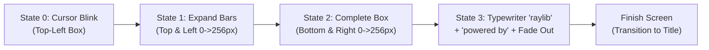

# Raylib Animated Splash Screen Skill

This skill provides patterns and implementation guidelines for procedural animated splash screens in Raylib C99, modeled directly after Ramon Santamaria's official Raylib animated logo splash (`screen_logo.c` from `cat_vs_roomba` and the Raylib Advance Game Template).

---

## 1. Architectural Philosophy: Procedural vs. Asset-Based

The official Raylib splash screen is **100% procedural**:
- **Zero Asset Dependencies**: Does not require loading external PNG textures or TTF fonts; uses Raylib primitives (`DrawRectangle`, `DrawText`, and `TextSubtext`).
- **Resolution Independence**: Centers dynamically on any viewport or `RenderTexture2D` canvas (`GetScreenWidth() / 2`, `GetScreenHeight() / 2`).
- **Clean Lifecycle**: Implements the standard screen management interface (`InitLogoScreen`, `UpdateLogoScreen`, `DrawLogoScreen`, `UnloadLogoScreen`, `FinishLogoScreen`).

---

## 2. The 4-State Splash Animation Machine

The animation progresses through four distinct sequential states driven by a frame counter and discrete geometry variables:



### State Breakdown

| State | Purpose | Transition Trigger | Visual Behavior |
| :---: | :--- | :--- | :--- |
| **`0`** | **Cursor Blink** | `framesCounter == 80` | Blinks a 16x16 square at top-left of logo: `(framesCounter / 10) % 2`. |
| **`1`** | **Top & Left Expansion** | `topSideRecWidth == 256` | Top bar widens by `+8px/frame`; left bar lengthens by `+8px/frame`. |
| **`2`** | **Bottom & Right Expansion** | `bottomSideRecWidth == 256` | Bottom bar widens by `+8px/frame`; right bar lengthens by `+8px/frame`. |
| **`3`** | **Text Typing & Fade Out** | `alpha <= 0.0f` | Typewriter effect on `"raylib"` via `TextSubtext()`, displays `"powered by"`, holds, then fades out alpha. |

---

## 3. Implementation Pattern (`screen_logo.c`)

```c
#include "raylib.h"

// Module local state
static int framesCounter = 0;
static int finishScreen = 0;

static int logoPositionX = 0;
static int logoPositionY = 0;

static int lettersCount = 0;

static int topSideRecWidth = 16;
static int leftSideRecHeight = 16;
static int bottomSideRecWidth = 16;
static int rightSideRecHeight = 16;

static int state = 0;
static float alpha = 1.0f;

void InitLogoScreen(void)
{
    finishScreen = 0;
    framesCounter = 0;
    lettersCount = 0;

    // Center 256x256 logo on canvas
    logoPositionX = GetScreenWidth() / 2 - 128;
    logoPositionY = GetScreenHeight() / 2 - 128;

    topSideRecWidth = 16;
    leftSideRecHeight = 16;
    bottomSideRecWidth = 16;
    rightSideRecHeight = 16;

    state = 0;
    alpha = 1.0f;
}

void UpdateLogoScreen(void)
{
    // Optional: Allow player to skip splash screen
    if (IsKeyPressed(KEY_SPACE) || IsKeyPressed(KEY_ENTER) || 
        IsKeyPressed(KEY_ESCAPE) || IsMouseButtonPressed(MOUSE_BUTTON_LEFT))
    {
        finishScreen = 1;
        return;
    }

    if (state == 0) // State 0: Blinking top-left cursor
    {
        framesCounter++;
        if (framesCounter == 80)
        {
            state = 1;
            framesCounter = 0;
        }
    }
    else if (state == 1) // State 1: Expand top and left borders
    {
        topSideRecWidth += 8;
        leftSideRecHeight += 8;
        if (topSideRecWidth >= 256) state = 2;
    }
    else if (state == 2) // State 2: Expand bottom and right borders
    {
        bottomSideRecWidth += 8;
        rightSideRecHeight += 8;
        if (bottomSideRecWidth >= 256) state = 3;
    }
    else if (state == 3) // State 3: Type out text and fade out
    {
        framesCounter++;

        if (lettersCount < 10)
        {
            // Type one letter every 12 frames
            if (framesCounter / 12)
            {
                lettersCount++;
                framesCounter = 0;
            }
        }
        else // Once all letters appear, hold for 200 frames, then fade out
        {
            if (framesCounter > 200)
            {
                alpha -= 0.02f;
                if (alpha <= 0.0f)
                {
                    alpha = 0.0f;
                    finishScreen = 1; // Signal transition to next screen
                }
            }
        }
    }
}

void DrawLogoScreen(void)
{
    if (state == 0)
    {
        if ((framesCounter / 10) % 2) 
        {
            DrawRectangle(logoPositionX, logoPositionY, 16, 16, BLACK);
        }
    }
    else if (state == 1)
    {
        DrawRectangle(logoPositionX, logoPositionY, topSideRecWidth, 16, BLACK);
        DrawRectangle(logoPositionX, logoPositionY, 16, leftSideRecHeight, BLACK);
    }
    else if (state == 2)
    {
        DrawRectangle(logoPositionX, logoPositionY, topSideRecWidth, 16, BLACK);
        DrawRectangle(logoPositionX, logoPositionY, 16, leftSideRecHeight, BLACK);

        DrawRectangle(logoPositionX + 240, logoPositionY, 16, rightSideRecHeight, BLACK);
        DrawRectangle(logoPositionX, logoPositionY + 240, bottomSideRecWidth, 16, BLACK);
    }
    else if (state == 3)
    {
        Color boxColor = Fade(BLACK, alpha);
        Color whiteFill = Fade(RAYWHITE, alpha);
        Color textColor = Fade(BLACK, alpha);
        Color subtextColor = Fade(DARKGRAY, alpha);

        // Draw outer borders
        DrawRectangle(logoPositionX, logoPositionY, topSideRecWidth, 16, boxColor);
        DrawRectangle(logoPositionX, logoPositionY + 16, 16, leftSideRecHeight - 32, boxColor);
        DrawRectangle(logoPositionX + 240, logoPositionY + 16, 16, rightSideRecHeight - 32, boxColor);
        DrawRectangle(logoPositionX, logoPositionY + 240, bottomSideRecWidth, 16, boxColor);

        // Draw inner white card
        DrawRectangle(GetScreenWidth() / 2 - 112, GetScreenHeight() / 2 - 112, 224, 224, whiteFill);

        // Draw typing 'raylib' logo text
        DrawText(TextSubtext("raylib", 0, lettersCount), 
                 GetScreenWidth() / 2 - 44, GetScreenHeight() / 2 + 48, 50, textColor);

        // Draw 'powered by' subtitle
        if (framesCounter > 20)
        {
            DrawText("powered by", logoPositionX, logoPositionY - 27, 20, subtextColor);
        }
    }
}

void UnloadLogoScreen(void)
{
    // No heap allocation or external texture to unload
}

int FinishLogoScreen(void)
{
    return finishScreen;
}
```

---

## 4. Integration with Screen Management State Machine

Combine with `raylib-screen-management` in your game loop:

```c
typedef enum {
    SCREEN_LOGO = 0,
    SCREEN_TITLE,
    SCREEN_PRACTICE,
    SCREEN_TIME_ATTACK
} GameScreen;

GameScreen currentScreen = SCREEN_LOGO;
InitLogoScreen();

while (!WindowShouldClose()) {
    float dt = GetFrameTime();

    switch (currentScreen) {
        case SCREEN_LOGO:
            UpdateLogoScreen();
            if (FinishLogoScreen()) {
                UnloadLogoScreen();
                currentScreen = SCREEN_TITLE;
                InitTitleScreen();
            }
            break;

        case SCREEN_TITLE:
            UpdateTitleScreen(&context, dt);
            break;
            
        // ...
    }

    BeginDrawing();
        ClearBackground(RAYWHITE);
        if (currentScreen == SCREEN_LOGO) DrawLogoScreen();
        else if (currentScreen == SCREEN_TITLE) DrawTitleScreen(&context);
    EndDrawing();
}
```

---

## 5. Best Practices & Polish

1. **Always Implement Skip Logic**: Players launching the game repeatedly will appreciate being able to press `SPACE`, `ENTER`, or mouse click to bypass the intro animation immediately.
2. **Virtual Canvas Scaling**: If using a virtual `RenderTexture2D` (e.g. 720x1280 portrait or 1280x720 landscape), use `virtualWidth / 2 - 128` instead of `GetScreenWidth()` so the logo scales cleanly with the virtual target buffer.
3. **Smooth Audio Cue**: Optionally play a quick whoosh or click sound when the box finishes expanding (`state == 2` $\rightarrow$ `state == 3`).
