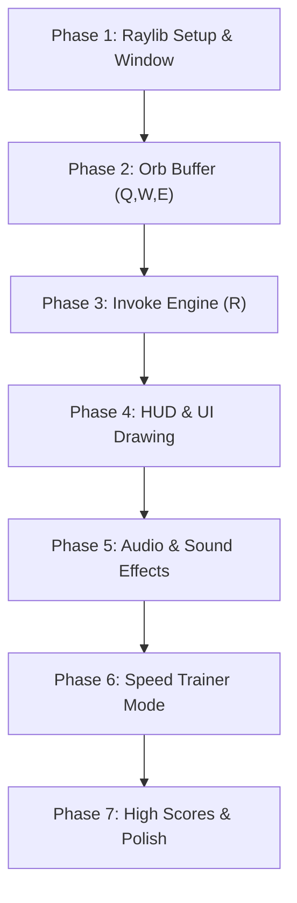

# PLANNING.md - Dota 2 Invoker Game (C + Raylib)

## 1. Project Overview

The **Invoker Game** is a fast-paced reaction and muscle-memory training game modeled after the iconic spell-casting mechanics of Invoker from Dota 2. Players combine three elemental reagents—**Quas**, **Wex**, and **Exort**—and press **Invoke** to manifest one of 10 distinct spells.

The project is developed in **C (C99)** using the **Raylib** library for graphics, audio, and input handling.

---

## 2. Invoker Core Mechanics Specification

### 2.1 The Three Elemental Orbs
| Key | Orb | Element | Theme Color | Properties |
| :--- | :--- | :--- | :--- | :--- |
| **Q** | **Quas** | Ice | Cyan / Ice Blue (`#00D2FF`) | Cold, control, ice manipulation |
| **W** | **Wex** | Storm | Violet / Pink (`#E040FB`) | Wind, lightning, swiftness |
| **E** | **Exort** | Fire | Amber / Red-Orange (`#FF5722`) | Fire, destruction, pure heat |

### 2.2 Orb Buffer Mechanics
- The player holds up to **3 active orbs** at any time.
- The buffer operates as a **FIFO (First-In, First-Out) sliding window**:
  - Initial state: Empty `[NONE, NONE, NONE]`.
  - When a key is pressed (`Q`, `W`, or `E`), the oldest orb is discarded and the new orb is pushed to the back.
  - *Example*: `[Q, Q, Q]` + `W` $\rightarrow$ `[Q, Q, W]` + `E` $\rightarrow$ `[Q, W, E]`.

### 2.3 The Invoke Mechanism (`R`)
- Pressing **R (Invoke)** analyzes the exact counts of Quas, Wex, and Exort currently in the 3-orb buffer.
- Order in the buffer **does not matter**; only the multiset count determines the spell:
  - $(Q_{count}, W_{count}, E_{count})$ such that $Q + W + E = 3$.
- Total combinations: $\binom{3+3-1}{3} = \frac{5!}{3!2!} = 10$ unique spells.

### 2.4 The 10 Spells Reference Table

| Spell Name | Recipe | Quas | Wex | Exort | Default Key | Description |
| :--- | :---: | :---: | :---: | :---: | :---: | :--- |
| **Cold Snap** | Q Q Q | 3 | 0 | 0 | `Y` / `D` | Freezes target repeatedly when taking damage. |
| **Ghost Walk** | Q Q W | 2 | 1 | 0 | `V` / `D` | Enters stealth, slowing nearby enemies. |
| **Ice Wall** | Q Q E | 2 | 0 | 1 | `G` / `D` | Generates a wall of ice that heavily slows enemies. |
| **EMP** | W W W | 0 | 3 | 0 | `C` / `D` | Charges an electromagnetic pulse burning mana. |
| **Tornado** | W W Q | 1 | 2 | 0 | `X` / `D` | Launches a vortex lifting enemies into the air. |
| **Alacrity** | W W E | 0 | 2 | 1 | `Z` / `D` | Grants massive attack speed and bonus damage. |
| **Sun Strike** | E E E | 0 | 0 | 3 | `T` / `D` | Global delayed beam of devastating pure fire. |
| **Forge Spirit** | E E Q | 1 | 0 | 2 | `F` / `D` | Summons an elemental spirit to fight alongside. |
| **Chaos Meteor** | E E W | 0 | 1 | 2 | `D` / `D` | Calls down a flaming meteor rolling forward. |
| **Deafening Blast**| Q W E | 1 | 1 | 1 | `B` / `D` | Sonic wave knocking back, damaging, and disarming. |

### 2.5 Invoked Spell Slot Logic (D & F)
Invoker has two active spell slots: **Slot 1 (Primary, key `D`)** and **Slot 2 (Secondary, key `F`)**.
When **R (Invoke)** is pressed:
1. Identify the new spell $S_{new}$ from the current 3 orbs.
2. If $S_{new}$ is **already in Slot 1**:
   - No change occurs (plays audio cue or fizzle).
3. If $S_{new}$ is **currently in Slot 2**:
   - Swap: Slot 2 moves to Slot 1, and the previous Slot 1 moves to Slot 2.
4. If $S_{new}$ is **neither in Slot 1 nor Slot 2**:
   - Slot 2 is overwritten by the contents of Slot 1.
   - Slot 1 receives $S_{new}$.

---

## 3. Game Modes

### Mode 1: Free Practice / Sandbox
- No timer, no fail condition.
- Real-time display of current orbs and spell slots.
- Cast testing: pressing `D` or `F` plays the spell sound effect and triggers a simulated cooldown.
- Visual spell-book helper showing all 10 recipes for quick reference.

### Mode 2: Speed Trainer / Time Attack
- The game displays a target spell icon and name (e.g., *"Invoke: Sun Strike!"*).
- The player must input the correct orbs and press `R` (optionally cast with `D`).
- **Timed Run**: 30 or 60 seconds.
- **Score System**:
  - Points awarded based on reaction time (faster invoke = higher score).
  - Combo multiplier increases with consecutive correct invokes.
  - Miss penalty: wrong invoke resets streak and deducts a small time/score penalty.
- Summary screen showing: Total Spells Invoked, Average Reaction Time (ms), Accuracy (%), and APM.

### Mode 3: Quiz / Recipe Memorization
- Displays a spell name/icon and asks for the 3 orbs without time pressure.
- Great for beginners to build initial neural pathways before attempting speed modes.

---

## 4. Software Architecture & Design

### 4.1 Recommended Directory Structure
```text
invoker-game/
├── Makefile             # Build automation
├── AGENTS.md            # Guidelines for AI assistants
├── PLANNING.md          # Master architecture and roadmap
├── assets/
│   ├── fonts/           # Clean HUD fonts (e.g. TTF)
│   ├── icons/           # Quas, Wex, Exort, Invoke, 10 spell icons
│   └── sounds/          # Orb clicks, invoke sound, spell audio cues
├── include/
│   ├── audio.h          # Audio manager interface
│   ├── config.h         # Game constants, window dimensions, keybindings
│   ├── game.h           # Game state machine and loop declarations
│   ├── orb.h            # Orb types, buffer logic, formula matching
│   ├── spell.h          # Spell definitions, properties, lookup
│   └── ui.h             # HUD layout, drawing functions, particle effects
└── src/
    ├── audio.c          # Raylib audio loading and playback
    ├── game.c           # Mode logic (Time Attack, Sandbox, State switches)
    ├── main.c           # Program entry point, main loop, init/shutdown
    ├── orb.c            # FIFO buffer operations, orb inputs
    ├── spell.c          # 10-spell registry and combination resolver
    └── ui.c             # Raylib rendering for orbs, slots, timers, and HUD
```

### 4.2 Key Data Structures

#### Orbs & Spells (`include/orb.h`, `include/spell.h`)
```c
typedef enum {
    ORB_NONE = 0,
    ORB_QUAS,
    ORB_WEX,
    ORB_EXORT
} OrbType;

typedef enum {
    SPELL_NONE = -1,
    SPELL_COLD_SNAP = 0,
    SPELL_GHOST_WALK,
    SPELL_ICE_WALL,
    SPELL_EMP,
    SPELL_TORNADO,
    SPELL_ALACRITY,
    SPELL_SUN_STRIKE,
    SPELL_FORGE_SPIRIT,
    SPELL_CHAOS_METEOR,
    SPELL_DEAFENING_BLAST,
    SPELL_COUNT
} SpellId;

typedef struct {
    SpellId id;
    const char *name;
    int req_quas;
    int req_wex;
    int req_exort;
    Color theme_color;
    float cooldown;
    // Texture2D icon; (loaded at runtime)
    // Sound sound;     (loaded at runtime)
} SpellInfo;

typedef struct {
    OrbType orbs[3];
    int count;
} OrbBuffer;

typedef struct {
    SpellId slot1; // Primary (D)
    SpellId slot2; // Secondary (F)
    float cooldown_slot1;
    float cooldown_slot2;
} SpellSlots;
```

#### Game State Machine (`include/game.h`)
```c
typedef enum {
    STATE_MENU,
    STATE_PRACTICE,
    STATE_TIME_ATTACK,
    STATE_QUIZ,
    STATE_GAME_OVER
} GameState;

typedef struct {
    GameState state;
    OrbBuffer orb_buffer;
    SpellSlots spell_slots;
    
    // Time Attack metrics
    SpellId target_spell;
    float timer_remaining;
    float reaction_timer;
    int score;
    int streak;
    int highest_streak;
    int total_attempted;
    int total_correct;
    float total_reaction_time;
} GameContext;
```

---

## 5. Development Roadmap & Milestones



### Phase 1: Environment & Raylib Window
- [ ] Create `Makefile` with proper Raylib compiler and linker flags for Linux.
- [ ] Implement clean `main.c` with 1280x720 window, 60 FPS target, and basic Raylib game loop.
- [ ] Verify clean compilation without warnings (`-Wall -Wextra`).

### Phase 2: Orb Buffer Engine (Q, W, E)
- [ ] Define `OrbType` enum and `OrbBuffer` struct in `include/orb.h`.
- [ ] Implement push function that maintains exactly the last 3 pressed orbs (FIFO).
- [ ] Bind keyboard input `KEY_Q`, `KEY_W`, `KEY_E`.
- [ ] Draw colored circles or placeholder shapes at the bottom-center of the screen representing active orbs.

### Phase 3: The Invoke Engine (R)
- [ ] Create spell registry with all 10 spells and their required $(Q, W, E)$ counts.
- [ ] Implement lookup function: `SpellId ResolveSpell(const OrbBuffer *buffer)`.
- [ ] Implement slot shift logic for Slot 1 and Slot 2 upon pressing `KEY_R`.
- [ ] Print invoked spell names on screen to confirm combination matching works 100% accurately.

### Phase 4: UI & HUD Aesthetics
- [ ] Design Dota 2 inspired bottom HUD bar:
  - 3 Orb indicator circles (Cyan, Violet, Orange).
  - Orb key label badges (`Q`, `W`, `E`).
  - Invoke button (`R`) with cooldown/ready state indicator.
  - Two active spell slot boxes (`D`, `F`) displaying spell names and colors.
- [ ] Add texture loading support (`assets/icons/`) with fallback procedural drawing when assets are absent.
- [ ] Add smooth key-press visual feedback (scaling/pulsing orbs on press).

### Phase 5: Audio & Sound Effects
- [ ] Initialize Raylib audio system (`InitAudioDevice` / `CloseAudioDevice`).
- [ ] Implement click/elemental audio for Quas, Wex, Exort.
- [ ] Add Invoke activation sound.
- [ ] Add casting audio for `D` and `F` triggers.

### Phase 6: Game Mode - Time Attack / Speed Trainer
- [ ] Implement random target spell selection.
- [ ] Display target spell banner with icon and name prominently.
- [ ] Implement round timer (e.g., 30 seconds countdown).
- [ ] Evaluate invoke accuracy:
  - Correct spell $\rightarrow$ play success sound, add score, increase combo streak, pick next target.
  - Incorrect spell $\rightarrow$ play error sound, reset streak, small score/time penalty.
- [ ] Create Game Over summary screen showing:
  - Final Score
  - Spells per minute (APM)
  - Average reaction time in milliseconds
  - Accuracy percentage

### Phase 7: Data Persistence & Final Polish
- [ ] Save best scores and personal records to a local file (`scores.dat`).
- [ ] Add simple particle system for orb trails and invoke burst.
- [ ] Screen shake effect on invoking powerful spells (Sun Strike, Chaos Meteor).
- [ ] Settings menu for key rebinding or audio volume sliders.

---

## 6. Technical Guidelines & Best Practices

1. **Explicit Memory & Resource Ownership**:
   - Every `LoadTexture` must have a corresponding `UnloadTexture`.
   - Every `LoadSound` must have a corresponding `UnloadSound`.
   - Load all assets during initialization (`InitGame`), unload during teardown (`ShutdownGame`).
2. **Zero Dynamic Allocation in Game Loop**:
   - Avoid `malloc` / `free` during the frame loop (`UpdateGame` / `DrawGame`).
   - Use fixed-size arrays and static lookup tables where possible.
3. **Deterministic State Updates**:
   - Separate state mutation (`UpdateGame(float dt)`) from rendering (`DrawGame()`).
   - Keep input handling responsive and tied to frame delta time for animations.
