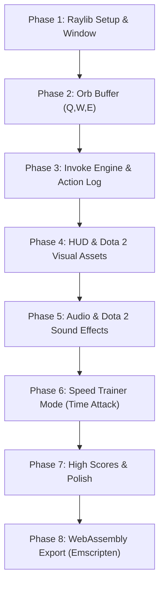

# ROADMAP.md - Dota 2 Invoker Game Roadmap & Milestones

For architectural design, game mechanics specifications, and data structures, see [PLANNING.md](./PLANNING.md).

---

## Development Milestones Overview

---

## Milestone Checklists

### Phase 1: Environment & Raylib Window
- [x] Create `Makefile` with proper Raylib compiler and linker flags for Linux.
- [x] Implement clean `main.c` with 1280x720 window, 60 FPS target, and basic Raylib game loop.
- [x] Verify clean compilation without warnings (`-Wall -Wextra`).

### Phase 2: Orb Buffer Engine (Q, W, E)
- [x] Define `OrbType` enum and `OrbBuffer` struct in `include/orb.h`.
- [x] Implement push function that maintains exactly the last 3 pressed orbs (FIFO).
- [x] Bind keyboard input `KEY_Q`, `KEY_W`, `KEY_E`.
- [x] Draw colored circles or placeholder shapes at the bottom-center of the screen representing active orbs.

### Phase 3: The Invoke Engine & On-Screen Action Log
- [x] Create spell registry with all 10 spells and their required $(Q, W, E)$ counts.
- [x] Implement lookup function: `SpellId ResolveSpell(const OrbBuffer *buffer)`.
- [x] Implement slot shift logic for Slot 1 and Slot 2 upon pressing `KEY_R`.
- [ ] Implement On-Screen Action Log / Event Feed:
  - [ ] Fixed-size message buffer (`MAX_LOG_ENTRIES`) without runtime heap allocations.
  - [ ] Log orb presses with color coding:
    - `"Pressed Q (Quas)"` in Cyan
    - `"Pressed W (Wex)"` in Violet
    - `"Pressed E (Exort)"` in Amber/Orange
  - [ ] Log spell invocations with spell theme color and recipe:
    - Successful: `"Invoked: Forge Spirit (E E Q)"`
    - Duplicate in Slot 1: `"Already in Slot 1: Forge Spirit"`
    - Incomplete buffer: `"Cannot invoke: Need 3 orbs"`
  - [ ] Timed entry decay / smooth alpha fade-out over time (`lifetime / max_lifetime`).
- [x] Render invoked spell slot badges (`D`, `F`) with active spell names and border colors.

### Phase 4: UI, HUD & Real Dota 2 Visual Assets
- [x] Design Dota 2 inspired bottom HUD bar:
  - [x] 3 Orb indicator circles (Cyan, Violet, Orange).
  - [x] Orb key label badges (`Q`, `W`, `E`).
  - [x] Invoke button (`R`) with ready state indicator.
  - [x] Two active spell slot boxes (`D`, `F`) displaying spell names and colors.
- [x] Source and prepare authentic Dota 2 icon assets (`assets/icons/`):
  - [x] 10 official spell icons (`cold_snap.png`, `sun_strike.png`, `chaos_meteor.png`, etc.).
  - [x] 3 elemental orb icons (`quas.png`, `wex.png`, `exort.png`) and `invoke.png`.
  - [x] Invoker hero portrait / avatar badge.
- [x] Implement Raylib texture loading and rendering pipeline (`LoadTexture` / `DrawTexturePro`).
- [x] Display authentic spell icons in active slots (`D`, `F`) and target prompt banner.
- [x] Maintain procedural fallback drawing when icon assets are absent.
- [ ] Integrate On-Screen Action Feed into HUD layout.
- [ ] Add smooth key-press visual feedback (scaling/pulsing orbs on press).

### Phase 5: Audio & Authentic Dota 2 Sound Effects
- [ ] Initialize Raylib audio system (`InitAudioDevice` / `CloseAudioDevice`).
- [ ] Source and integrate authentic Dota 2 sound effects (`assets/sounds/`):
  - Elemental orb invocation sound cues for Quas, Wex, and Exort.
  - The iconic Dota 2 Invoke ability sound cue.
  - Spell casting sound effects for Slot 1 (`D`) and Slot 2 (`F`) triggers.
- [ ] Source and integrate iconic Invoker hero voice responses:
  - On game start / countdown ("A spell I well remember!", "Fight on, Carl!").
  - On streak milestones and combo streaks.
  - On game over / APM rating summary.
- [ ] Implement pitch variation / randomization on orb clicks for natural audio feel.

### Phase 6: Speed Trainer Mode (Time Attack)
- [x] Implement random target spell selection.
- [x] Display target spell banner with icon and name prominently.
- [ ] Implement round timer (e.g., 30 or 60 seconds countdown).
- [x] Evaluate invoke accuracy:
  - [x] Correct spell $\rightarrow$ add score, increase combo streak, pick next target.
  - [x] Incorrect spell $\rightarrow$ reset streak, visual miss feedback.
- [ ] Create Game Over summary screen showing:
  - Final Score
  - Spells per minute (APM)
  - Average reaction time in milliseconds
  - Accuracy percentage

### Phase 7: High Scores & v1.0 Polish
- [ ] Save best scores and personal records to a local file (`scores.dat`).
- [ ] Add simple particle system for orb trails and invoke burst.
- [ ] Settings/help overlay for keybindings and spell recipe list.
- [ ] Release v1.0!

### Phase 8: WebAssembly & HTML5 Export (Emscripten)
- [ ] Configure Emscripten build pipeline (`emcc`) in `Makefile` (e.g. `make web` target).
- [ ] Adapt game loop for WebAssembly using `#if defined(PLATFORM_WEB)` and `emscripten_set_main_loop`.
- [ ] Bundle and preload game assets (`--preload-file assets/`) for browser filesystem access.
- [ ] Provide a responsive HTML5 shell template (`shell.html`) with canvas scaling and key event capturing.
- [ ] Test in web browsers via local test server (`python3 -m http.server`).
- [ ] Deploy playable web version to GitHub Pages / itch.io.
