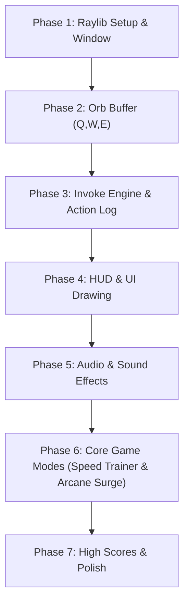

# ROADMAP.md - Dota 2 Invoker Game Roadmap & Milestones

For architectural design, game mechanics specifications, and data structures, see [PLANNING.md](./PLANNING.md).

---

## Development Milestones Overview

---

## Milestone Checklists

### Phase 1: Environment & Raylib Window
- [x] Create `Makefile` with proper Raylib compiler and linker flags for Linux.
- [x] Implement clean `main.c` with 1280x720 window, 60 FPS target, and basic Raylib game loop.
- [x] Verify clean compilation without warnings (`-Wall -Wextra`).

### Phase 2: Orb Buffer Engine (Q, W, E)
- [x] Define `OrbType` enum and `OrbBuffer` struct in `include/orb.h`.
- [x] Implement push function that maintains exactly the last 3 pressed orbs (FIFO).
- [x] Bind keyboard input `KEY_Q`, `KEY_W`, `KEY_E`.
- [x] Draw colored circles or placeholder shapes at the bottom-center of the screen representing active orbs.

### Phase 3: The Invoke Engine & On-Screen Action Log
- [x] Create spell registry with all 10 spells and their required $(Q, W, E)$ counts.
- [x] Implement lookup function: `SpellId ResolveSpell(const OrbBuffer *buffer)`.
- [x] Implement slot shift logic for Slot 1 and Slot 2 upon pressing `KEY_R`.
- [ ] Implement On-Screen Action Log / Event Feed:
  - [ ] Fixed-size message buffer (`MAX_LOG_ENTRIES`) without runtime heap allocations.
  - [ ] Log orb presses with color coding:
    - `"Pressed Q (Quas)"` in Cyan
    - `"Pressed W (Wex)"` in Violet
    - `"Pressed E (Exort)"` in Amber/Orange
  - [ ] Log spell invocations with spell theme color and recipe:
    - Successful: `"Invoked: Forge Spirit (E E Q)"`
    - Duplicate in Slot 1: `"Already in Slot 1: Forge Spirit"`
    - Incomplete buffer: `"Cannot invoke: Need 3 orbs"`
  - [ ] Timed entry decay / smooth alpha fade-out over time (`lifetime / max_lifetime`).
- [ ] Render invoked spell slot badges (`D`, `F`) with active spell names and border colors.

### Phase 4: UI, HUD Aesthetics & Slot Casting
- [ ] Design Dota 2 inspired bottom HUD bar:
  - 3 Orb indicator circles (Cyan, Violet, Orange).
  - Orb key label badges (`Q`, `W`, `E`).
  - Invoke button (`R`) with ready state indicator.
  - Two active spell slot boxes (`D`, `F`) displaying spell names and colors.
- [ ] Implement baseline spell casting on `KEY_D` and `KEY_F`:
  - Triggers cast sound and logs `"Cast <Spell Name> [Key]"` to the action feed.
  - Free-Cast mode by default (0s cooldown, infinite mana for muscle-memory training).
- [ ] Design conditional HUD Realism Overlays (for Practice toggle & Simulation mode):
  - Glowing blue HUD Mana Bar beneath active slots with `[current / max]` text and `+regen/s`.
  - Translucent dark cooldown sweep / overlay on slot boxes with numeric countdown timer (`14.5s`).
- [ ] Add texture loading support (`assets/icons/`) with fallback procedural drawing when assets are absent.
- [ ] Add smooth key-press visual feedback (scaling/pulsing orbs on press).

### Phase 5: Audio & Sound Effects
- [ ] Initialize Raylib audio system (`InitAudioDevice` / `CloseAudioDevice`).
- [ ] Implement click/elemental audio for Quas, Wex, Exort.
- [ ] Add Invoke activation sound.
- [ ] Add casting audio for `D` and `F` triggers, and "out of mana" / fizzle error cues.

### Phase 6: Core Game Modes

#### 6.1 Mode: Time Attack / Speed Trainer (Free-Cast Rules)
- [ ] Implement random target spell selection.
- [ ] Display target spell banner with icon and name prominently.
- [ ] Runs with Free-Cast rules (unlimited mana, zero cooldowns) for pure APM reaction training.
- [ ] Implement round timer (e.g., 30 seconds countdown).
- [ ] Evaluate invoke accuracy:
  - Correct spell $\rightarrow$ play success sound, add score, increase combo streak, pick next target.
  - Incorrect spell $\rightarrow$ play error sound, reset streak, small score/time penalty.
- [ ] Create Game Over summary screen showing:
  - Final Score
  - Spells per minute (APM)
  - Average reaction time in milliseconds
  - Accuracy percentage

#### 6.2 Mode: Arcane Surge / Momentum Mode (Free-Cast Rules)
- [ ] Implement `STATE_SURGE` mode loop and state transition:
  - Initialize gauge values (`surge_meter = 0.0f`, `surge_max = 10.0f`, `surge_decay_rate = 0.4f`).
  - Operates under Free-Cast rules to allow rapid spell cycling.
- [ ] Implement continuous delta-time drain:
  - `surge_meter -= surge_decay_rate * dt` (clamped to `[0.0f, surge_max]`).
- [ ] Implement invoke volume injection on `KEY_R`:
  - Validate successful invocation (`SpellId != SPELL_NONE`).
  - Anti-spam check: prevent spamming the identical spell repeatedly by requiring spell cycling or awarding reduced charge.
  - Increment bar: `surge_meter += 1.0f`.
- [ ] Design and draw HUD Arcane Surge Bar:
  - Outer border and empty background track.
  - Smooth animated bar fill with dynamic color gradient (Cyan $\rightarrow$ Purple $\rightarrow$ Blazing Gold).
  - Text readout: `[SURGE: 7 / 10]` with pulse/flash on hit.
- [ ] Win / Clear Condition:
  - Reaching `surge_meter >= surge_max` triggers **Surge Overload** banner, logs final completion time, and offers Next Tier escalation.

#### 6.3 Mode: Match Simulation / Combo Trial (Realism Rules)
- [ ] Implement `STATE_SIMULATION` mode loop and enable `enable_mana_and_cooldowns = true`:
  - Initialize Mana Pool (`1000.0f` max, `+15.0f` mana/sec) and per-spell cooldown array `spell_cooldowns[SPELL_COUNT]`.
  - Continuous delta-time updates: regenerate mana and tick down active spell cooldowns.
- [ ] Implement strict casting constraints for `KEY_D` and `KEY_F`:
  - Validate mana sufficiency (`current_mana >= mana_cost`) and cooldown ready (`spell_cooldowns[id] <= 0.0f`).
  - Deduct mana cost and apply base cooldown on cast.
  - Action log & audio feedback for `"Spell on cooldown"` or `"Not enough mana"`.
- [ ] Implement Combo Trial challenge sequence:
  - Display target combo chain prompt (e.g. *Eul's Combo: Tornado $\rightarrow$ Sun Strike $\rightarrow$ Chaos Meteor $\rightarrow$ Deafening Blast*).
  - Validate sequential invocation and casting within combo timing windows.
- [ ] Summary screen showing combo completion time, mana efficiency, and execution score.

### Phase 7: Data Persistence & Final Polish
- [ ] Save best scores and personal records to a local file (`scores.dat`).
- [ ] Add simple particle system for orb trails and invoke burst.
- [ ] Screen shake effect on invoking powerful spells (Sun Strike, Chaos Meteor).
- [ ] Settings menu for key rebinding or audio volume sliders.
