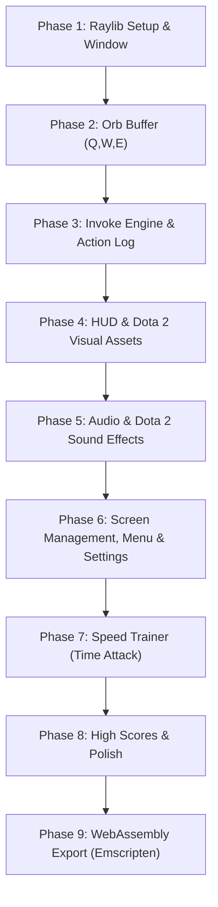

# ROADMAP.md - Dota 2 Invoker Game Roadmap & Milestones

For architectural design, game mechanics specifications, and data structures, see [PLANNING.md](./PLANNING.md).

---

## Development Milestones Overview

---

## Milestone Checklists

### Phase 1: Environment & Raylib Window
- [x] Create `Makefile` with proper Raylib compiler and linker flags for Linux.
- [x] Implement clean `main.c` with 1280x720 window, 60 FPS target, and basic Raylib game loop.
- [x] Verify clean compilation without warnings (`-Wall -Wextra`).

### Phase 2: Orb Buffer Engine (Q, W, E)
- [x] Define `OrbType` enum and `OrbBuffer` struct in `include/orb.h`.
- [x] Implement push function that maintains exactly the last 3 pressed orbs (FIFO).
- [x] Bind keyboard input `KEY_Q`, `KEY_W`, `KEY_E`.
- [x] Draw colored circles or placeholder shapes at the bottom-center of the screen representing active orbs.

### Phase 3: The Invoke Engine & On-Screen Action Log
- [x] Create spell registry with all 10 spells and their required $(Q, W, E)$ counts.
- [x] Implement lookup function: `SpellId ResolveSpell(const OrbBuffer *buffer)`.
- [x] Implement slot shift logic for Slot 1 and Slot 2 upon pressing `KEY_R`.
- [x] Implement On-Screen Action Log / Event Feed:
  - [x] Fixed-size message buffer (`MAX_LOG_ENTRIES`) without runtime heap allocations.
  - [x] Log orb presses with color coding:
    - `"Pressed Q (Quas)"` in Cyan
    - `"Pressed W (Wex)"` in Violet
    - `"Pressed E (Exort)"` in Amber/Orange
  - [x] Log spell invocations with spell theme color and recipe:
    - Successful: `"Invoked: Forge Spirit (E E Q)"`
    - Duplicate in Slot 1: `"Already in Slot 1: Forge Spirit"`
    - Incomplete buffer: `"Cannot invoke: Need 3 orbs"`
  - [x] Sticky persistent FIFO action feed with tactile entry highlight pulse (no time decay).
- [x] Render invoked spell slot badges (`D`, `F`) with active spell names and border colors.

### Phase 4: UI, HUD & Real Dota 2 Visual Assets
- [x] Design Dota 2 inspired bottom HUD bar:
  - [x] 3 Orb indicator circles (Cyan, Violet, Orange).
  - [x] Orb key label badges (`Q`, `W`, `E`).
  - [x] Invoke button (`R`) with ready state indicator.
  - [x] Two active spell slot boxes (`D`, `F`) displaying spell names and colors.
- [x] Source and prepare authentic Dota 2 icon assets (`assets/icons/`):
  - [x] 10 official spell icons (`cold_snap.png`, `sun_strike.png`, `chaos_meteor.png`, etc.).
  - [x] 3 elemental orb icons (`quas.png`, `wex.png`, `exort.png`) and `invoke.png`.
  - [x] Invoker hero portrait / avatar badge.
- [x] Implement Raylib texture loading and rendering pipeline (`LoadTexture` / `DrawTexturePro`).
- [x] Display authentic spell icons in active slots (`D`, `F`) and target prompt banner.
- [x] Maintain procedural fallback drawing when icon assets are absent.
- [x] Integrate On-Screen Action Feed into HUD layout.
- [x] Add smooth key-press visual feedback (scaling/pulsing orbs on press).

### Phase 5: Audio & Authentic Dota 2 Sound Effects
- [x] Initialize Raylib audio system (`InitAudioDevice` / `CloseAudioDevice`).
- [x] Source and integrate authentic Dota 2 sound effects (`assets/sounds/`):
  - Elemental orb invocation sound cues for Quas, Wex, and Exort.
  - The iconic Dota 2 Invoke ability sound cue (`invoke.mp3`).
  - Spell casting sound effects for Slot 1 (`D`) and Slot 2 (`F`) triggers (all 10 spells).
- [x] Source and integrate iconic Invoker hero voice responses:
  - On game start / countdown ("Carl!", "So begins a new age of knowledge.").
  - On streak milestones (5, 10, 15, 20) and combo streaks ("A spell I well remember!", "Glorious invocation!", "Enlightenment is mine!").
  - On streak loss / miss ("My mind... unravels!").
- [x] Implement pitch variation / randomization on orb clicks for natural audio feel.

### Phase 6: Screen Management, Splash Screen, Menu & Settings
- [x] Implement procedural animated "Powered by Raylib" Splash Screen (`SCREEN_LOGO`) following [`.agents/skills/raylib-splash-screen/SKILL.md`](./.agents/skills/raylib-splash-screen/SKILL.md):
  - 4-state procedural animation: blinking cursor $\rightarrow$ expanding border bars $\rightarrow$ typewriter `"raylib"` text $\rightarrow$ alpha fade-out.
  - Immediate skip functionality on `KEY_SPACE`, `KEY_ENTER`, `KEY_ESCAPE`, or mouse click.
  - Seamless auto-transition from `SCREEN_LOGO` to `SCREEN_MENU`.
- [x] Implement enum-driven screen state machine following [`.agents/skills/raylib-screen-management/SKILL.md`](./.agents/skills/raylib-screen-management/SKILL.md):
  - Screen enum: `SCREEN_LOGO`, `SCREEN_MENU`, `SCREEN_PRACTICE`, `SCREEN_TIME_ATTACK`, `SCREEN_ENDLESS`, `SCREEN_SPELLBOOK`, `SCREEN_GAME_OVER`.
  - Dual-switch update (`Update...Screen()`) and draw (`Draw...Screen()`) loop architecture.
- [x] Design Dota 2 inspired Title / Main Menu Screen:
  - Invoker hero portrait frame, title banner, and elemental badge styling.
  - Interactive menu buttons: `PLAY`, `HIGH SCORE`, `SETTINGS`, `HELP`, `QUIT GAME`.
  - Nested submenus:
    - **PLAY**: `ENDLESS`, `TIME ATTACK`, `PRACTICE MODE`, `< BACK`.
    - **HELP**: `SPELL BOOK`, `CONTROLS & BASICS`, `< BACK`.
  - Full keyboard navigation (`KEY_UP`, `KEY_DOWN`, `KEY_ENTER`, number hotkeys 1-5) and mouse hover/click interaction.
- [x] Screen transitions and state initialization:
  - Smooth fade-in and fade-out alpha transitions (`ScreenTransition`).
  - State reset helper `ResetGameplaySession(&ctx, mode)` on mode launch.
  - Quick return to menu on `KEY_ESCAPE`.
- [x] Interactive Spell Book screen (`SCREEN_SPELLBOOK`):
  - Catalog of all 10 spells with icons, elemental recipe badges, and click-to-audition audio playback.
- [x] Settings & Audio Configuration view:
  - Interactive audio controls with volume sliders and mute toggles:
    - Master Volume (`0.0f` to `1.0f`)
    - SFX Volume (`0.0f` to `1.0f`) & Mute Toggle (orb clicks, invoke sound)
    - Hero Voice Volume (`0.0f` to `1.0f`) & Mute Toggle (Invoker voice lines)
    - Music Volume (`0.0f` to `1.0f`) & Mute Toggle
  - Gameplay preference toggles:
    - Recipe Helper toggle (on-screen 10-spell cheat sheet)
    - Action Feed toggle (on-screen event log)
    - Screen Shake toggle (heavy spell cast feedback)
  - Zero-allocation binary file persistence:
    - `SaveSettings(&ctx->settings)` and `LoadSettings(&ctx->settings)` to `settings.dat`.

### Phase 7: Endless Survival & Speed Trainer (Time Attack)
- [x] Implement random target spell selection.
- [x] Display target spell banner with icon and name prominently.
- [x] Implement Endless Survival Mode:
  - 15.0-second starting timer with real-time countdown.
  - +2.5s time bonus per correct spell invocation (capped at 25s max bank).
  - Immediate Sudden Death elimination on any miss or incomplete orb buffer.
- [x] Implement Time Attack round timer (60s countdown).
- [x] Evaluate invoke accuracy:
  - [x] Correct spell $\rightarrow$ add score, increase combo streak, pick next target.
  - [x] Incorrect spell $\rightarrow$ reset streak (Time Attack/Practice) or Sudden Death (Endless).
- [x] Create Game Over popup modal with official Dota 2 rank badge:
  - Official Dota 2 Rank evaluation from **Herald** to **Immortal** based on spells invoked.
  - Summary metrics: Final Score, Total Spells Invoked, Max Strike/Streak, Accuracy %, and Time Survived.
  - Interactive "TRY AGAIN" and "MAIN MENU" action buttons with keyboard hotkeys.

### Phase 8: High Scores, Visual Effects & v1.0 Polish
- [x] Save best scores and personal records to a local file (`scores.dat`):
  - Hall of Invocation view displaying personal records for Endless and Time Attack.
  - Dota 2 Rank tier progression ladder overview.
- [x] Implement zero-allocation elemental particle system and dynamic screen shake:
  - Fixed-pool particle system (`ParticleSystem`, 256 particles) with zero heap allocation in game loop.
  - Quas ice crystals (cyan drifting flakes with gravity).
  - Wex storm sparks (electric violet high-speed erratic bursts).
  - Exort fire embers (amber/orange rising buoyant sparks).
  - 360-degree radial ring bursts on spell invocation (`R`) and cast keys (`D` & `F`).
  - Celebratory spell success bursts over target spell card on correct invocation.
  - Dynamic screen shake on heavy spells and misses, configurable via Settings toggle.
- [x] Release v1.0!

### Phase 9: WebAssembly & HTML5 Export (Emscripten)
- [x] Configure Emscripten build pipeline (`emcc`) in `Makefile` (`make web`, `make run-web`).
- [x] Adapt game loop for WebAssembly using `#if defined(PLATFORM_WEB)` and `emscripten_set_main_loop`.
- [x] Bundle and preload game assets (`--preload-file assets`) for browser virtual filesystem access.
- [x] Provide a responsive HTML5 shell template (`src/shell.html`) with 9:16 aspect ratio canvas scaling and key event capturing.
- [x] Test in web browsers via local test server (`make run-web`).
- [x] Create reusable project skill `.agents/skills/raylib-web-assembly/SKILL.md` for Raylib WASM export patterns.
- [x] Deployable WebAssembly package in `build/web/` ready for itch.io / GitHub Pages.

